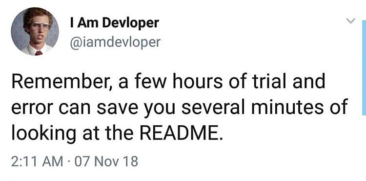

## Assignment 1: Git Readme

### Full-Stack Web Development

**Full-Stack Web Development** is development on the front and back ends of a site. This can involve everything from styling and page layouts to server and database work on the backend. In order to do this, they have to have experience in various frameworks and languages. These include (but are not limited to) MySQL, PHP, HTML, CSS, JavaScript, PHP, and frameworks like React or Angular. They are usually considered the "jack of all trades" when it comes to Web Development.

### Node.js Understanding

**Node.js**, and its package manager **NPM** are critical tools for developers. Node allows developers to easily incorporate JavaScript code into their projects. Developers can set scripts in their `package.json` file to do things like run their live server, compile SASS files into CSS, and many more. NPM is a library of hundreds, if not thousands, of different packages for developers to install for their projects. These can range from things like **Git** to useful developer tools like SASS. Node is *critical* for developers.

### Version Control, Git, & GitHub

**Version Control** is the process of managing a project across multiple devices and (usually) multiple developers. Using a tool like GitHub, multiple developers can get a repository installed onto their computer. This repository is where the project will be held. Those various developers can then independantly work on different parts of the project, and "push" them up to the main branch of the project. Other developers can then "pull" this data onto their local copy of the project, and work with the most up-to-date version. 

### Markdown & Documentation

**Markdown**, or .MD files, are the files that README files consist of. These files have various styling methods, like **bolding** or *italicizing* text. Additionally, developers can add `code blocks` to illustrate important commands or lines of code. It is very useful to document the process in the README file, escpecially any major issues you run into. Keeping track of these issues allows you to avoid strife later, as you can use your README files as a guidebook. 

### That's All! Thanks for Reading
